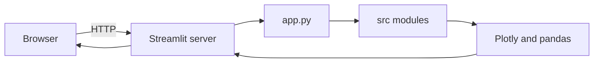

# Architecture

This document describes how the Crypto Market Analyzer is structured today and how it is expected to evolve. For setup and run instructions, see [README.md](../README.md).

## Overview

The application is a Streamlit client with a thin entrypoint in [`app.py`](../app.py) and UI modules under [`src/`](../src/). The browser talks to a Streamlit server that reruns the entry script on interaction. There is no separate backend service, database, or job runner in the repository yet.

The product direction in [README.md](../README.md) calls for Python data pipelines, alerts, and newsletter automation. Those capabilities are represented in [`requirements.txt`](../requirements.txt) as forward-looking dependencies but are not wired into the UI beyond mock data today.

## Runtime flow

On each run, `app.py` configures the page, applies global styles, renders the sidebar, and composes dashboard panels through `render_*` functions in `src/components/`. Mock series and tables come from `src/data/mock_market.py`. Newsletter validation uses `src/validation/email.py`.

## Module map

| Path | Role |
|------|------|
| [`app.py`](../app.py) | Streamlit entrypoint and layout orchestration |
| [`src/styles.py`](../src/styles.py) | Global CSS injection |
| [`src/components/sidebar.py`](../src/components/sidebar.py) | Sidebar branding and controls |
| [`src/components/dashboard_header.py`](../src/components/dashboard_header.py) | Greeting and UTC snapshot caption |
| [`src/components/kpi_row.py`](../src/components/kpi_row.py) | KPI card row |
| [`src/components/price_trend.py`](../src/components/price_trend.py) | Price trend chart panel |
| [`src/components/trending_report.py`](../src/components/trending_report.py) | Trending report table |
| [`src/components/risk_graph.py`](../src/components/risk_graph.py) | Risk bar chart panel |
| [`src/components/feed_panels.py`](../src/components/feed_panels.py) | Alerts and news snapshot panels |
| [`src/components/newsletter.py`](../src/components/newsletter.py) | Newsletter subscription form |
| [`src/data/mock_market.py`](../src/data/mock_market.py) | Mock market series, table, and risk inputs |
| [`src/validation/email.py`](../src/validation/email.py) | Newsletter email validation |

Import flow: `app.py` imports component renderers and `inject_global_styles()`. Components import mock data or validation helpers as needed. There is no shared state module yet.

## UI composition

### Sidebar

The sidebar shows branding, a navigation radio group, a time-window select box, and a watchlist multiselect. The navigation labels (Dashboard, Alerts, News, Risk, Newsletter) are presentational only: selecting a different item does not route to a separate page or change the main layout.

### Main dashboard

The main area is a single dashboard view:

- Header with greeting and a UTC timestamp from `datetime.utcnow()`
- Four KPI cards (market cap, volume, risk index, active alerts) rendered as HTML snippets
- Left column: price trend chart (synthetic BTC series plus rolling mean) and trending report table
- Right column: horizontal risk bar chart, static alerts list, and static news snapshot
- Footer panel: newsletter email, frequency, format, and subscribe button with basic email validation

Styling uses injected CSS for cards and panels; layout uses Streamlit columns.

## Data today vs planned

| Area | Today | Planned |
|------|-------|---------|
| Market KPIs | Hard-coded HTML values in KPI component | Ingestion from market APIs or aggregated feeds |
| Price trend | Mock series from `src/data/mock_market.py` | Live or cached OHLCV per watchlist asset |
| Trending report | Static pandas `DataFrame` in mock data module | Computed rankings and sentiment from pipeline output |
| Risk graph | Fixed bar scores in mock data module | Derived risk model inputs and history |
| Alerts and news | Static HTML copy in feed panels | Rules engine plus news aggregation |
| Newsletter | Client-side validation and success message only | Persistence, scheduling, and outbound delivery |
| Sidebar filters | Widget state only; no effect on data | Drive queries and chart windows |

No environment variables or `.env` files are required to run the current UI. [`python-dotenv`](../requirements.txt) is listed for future configuration of API keys and service endpoints.

## Dependencies

| Package | Role today | Role planned |
|---------|------------|--------------|
| `streamlit` | UI shell, widgets, layout | Same |
| `pandas` | Trending table and rolling mean on mock prices | Pipeline transforms and report tables |
| `plotly` | Price trend and risk charts | Same |
| `requests` | Not used in `app.py` | HTTP market and news sources |
| `feedparser` | Not used in `app.py` | RSS and feed ingestion |
| `schedule` | Not used in `app.py` | Periodic jobs (reports, newsletter) |
| `pydantic` | Not used in `app.py` | Validated config and API models |
| `python-dotenv` | Not used in `app.py` | Local and deployment secrets |

CI and local setup install the full [`requirements.txt`](../requirements.txt) even though the entrypoint only imports a subset.

## Repository boundaries

| Path | Role |
|------|------|
| [`app.py`](../app.py) | Production UI entrypoint |
| [`src/`](../src/) | Streamlit UI modules, mock data, and validation helpers |
| [`requirements.txt`](../requirements.txt) | Python dependencies |
| [`docs/`](../docs/) | Architecture and automation playbooks |

## Automation

- **CI** ([`.github/workflows/ci.yml`](../.github/workflows/ci.yml)): on push and pull request to `main`, `master`, and `feat/**`, installs dependencies on Python 3.11 and compiles `app.py` with `py_compile`. It does not start Streamlit or run browser tests.
- **Dev Container** ([`.devcontainer/devcontainer.json`](../.devcontainer/devcontainer.json)): installs dependencies via `updateContentCommand` on create and update. Streamlit is not started automatically; run `streamlit run app.py` from the repository root after the container is ready.

## Evolution

Near-term architecture aligned with [README.md](../README.md) product scope:

- Back sidebar time window and watchlist with real query parameters
- Implement multi-page or routed views when Alerts, News, Risk, and Newsletter become distinct experiences
- Replace mock data providers with ingestion modules as pipelines mature
- Add scheduled workers for newsletter generation and alert evaluation, using packages already listed in `requirements.txt`
- Keep active code at the repo root, under `src/`, and under `docs/`
