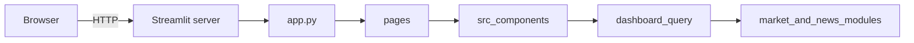
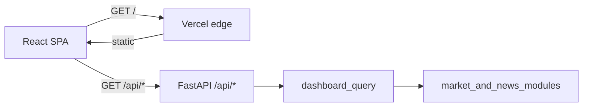

# Architecture

This document describes how ChainTelescope is structured today. For setup and run instructions, see [README.md](../README.md).

## Overview

The application has two UI layers that share the same data and API layer:

1. **Streamlit client** (legacy, local dev) — entrypoint in [`app.py`](../app.py), routed pages under [`pages/`](../pages/), UI modules under [`src/`](../src/). The browser talks to a Streamlit server that reruns the entry script on interaction.
2. **React SPA** (primary, Vercel-deployed) — lives under [`frontend/`](../frontend/), consumes the FastAPI REST API at [`src/api.py`](../src/api.py). Deployed on Vercel alongside the FastAPI backend.

Both UIs consume the same data layer in [`src/data/`](../src/data/) and the same FastAPI endpoints. Streamlit is kept as a rapid-prototyping fallback; the React SPA is the deployment target.

The product direction in [README.md](../README.md) calls for Python data pipelines, alerts, and newsletter automation. Market and feed ingestion modules are wired through a shared dashboard query layer with mock and remote fallbacks.

## Related documentation

- [CHANGELOG.md](../CHANGELOG.md) — release history
- [configuration.md](configuration.md) — environment variables and secrets
- [source-inventory-m4.md](source-inventory-m4.md) — M4 source discovery research

## Runtime flow

### Streamlit (local dev)

On each run, `app.py` configures the page, applies global styles, and delegates to `st.navigation` routes in `pages/`. Shared sidebar filters come from [`src/app_shell.py`](../src/app_shell.py). Dashboard panels consume a `DashboardSnapshot` from [`src/data/dashboard_query.py`](../src/data/dashboard_query.py).

### FastAPI + React SPA (Vercel, production)

Vercel routes all `/api/*` requests to the FastAPI serverless function at `src/api.py` and all other requests to the React SPA static build in `frontend/dist/`. The React SPA calls the FastAPI endpoints for all data (snapshot, news, alerts, assistant). See [ADR-003](adr/003-fastapi-react-vercel.md) for the full deployment architecture.

## Module map

| Path | Role |
|------|------|
| [`app.py`](../app.py) | Streamlit entrypoint and navigation shell |
| [`pages/`](../pages/) | Routed Dashboard, Alerts, News, Risk, and Newsletter pages |
| [`src/app_shell.py`](../src/app_shell.py) | Sidebar filter engine (time window, watchlist, market source, trend filter) |
| [`src/styles.py`](../src/styles.py) | Global CSS injection |
| [`src/components/dashboard_header.py`](../src/components/dashboard_header.py) | Greeting and UTC snapshot caption |
| [`src/components/kpi_row.py`](../src/components/kpi_row.py) | KPI card row |
| [`src/components/price_trend.py`](../src/components/price_trend.py) | Price trend chart panel |
| [`src/components/trending_report.py`](../src/components/trending_report.py) | Trending report table |
| [`src/components/risk_graph.py`](../src/components/risk_graph.py) | Risk bar chart panel |
| [`src/components/feed_panels.py`](../src/components/feed_panels.py) | Alerts and news snapshot panels |
| [`src/components/assistant.py`](../src/components/assistant.py) | In-app GPT assistant with safe fallbacks |
| [`src/components/newsletter.py`](../src/components/newsletter.py) | Newsletter subscription form and saved subscriptions |
| [`src/data/dashboard_query.py`](../src/data/dashboard_query.py) | Filter-aware dashboard snapshot assembly |
| [`src/data/mock_market.py`](../src/data/mock_market.py) | Mock market series, table, and risk inputs |
| [`src/data/market/`](../src/data/market/) | Market provider adapters and fallback orchestration |
| [`src/data/news/`](../src/data/news/) | Feed ingestion and normalized feed models |
| [`src/data/alerts/rules.py`](../src/data/alerts/rules.py) | MVP threshold rules for alert output |
| [`src/data/newsletter/`](../src/data/newsletter/) | Local subscription persistence and stub delivery |
| [`src/validation/email.py`](../src/validation/email.py) | Newsletter email validation |
| [`src/logging.py`](../src/logging.py) | Structured loguru sink configuration |
| [`src/views/__init__.py`](../src/views/__init__.py) | Cached dashboard snapshot wrapper (`@st.cache_data(ttl=30)`) |
| [`notebooks/`](../notebooks/) | Jupyter notebooks for EDA, strategy backtesting, and report generation |

Import flow: routed pages import view renderers and shared filters. Views call `load_dashboard_snapshot(time_window, watchlist, market_source, trend_filter)` and pass the snapshot into components.

## UI composition

### Sidebar

The sidebar shows branding, a time-window select box, and a watchlist multiselect. Navigation is owned by `st.navigation` in `app.py`, not by a decorative radio group.

### Routed pages

- **Dashboard:** header, KPI cards, price trend, trending report, risk graph, alerts/news snapshots, and assistant chat
- **Alerts:** rule-driven alert output and configured rule documentation
- **News:** normalized feed items with safe fallback
- **Risk:** risk graph for the selected window
- **Newsletter:** subscribe form, local persistence, and stub delivery messaging

Styling uses injected CSS for cards and panels; layout uses Streamlit columns.

## Filter-to-data flow

1. Sidebar widgets in `src/app_shell.py` return `time_window` and `watchlist`.
2. `load_dashboard_snapshot()` maps the time window to a day count and selects the primary watchlist asset for the price chart.
3. Market adapters in `src/data/market/` attempt remote providers, then fall back to mock series in `src/data/mock_market.py`.
4. News ingestion in `src/data/news/` loads RSS/Atom feeds or fallback items and filters by watchlist tags/titles when possible.
5. Alert rules in `src/data/alerts/rules.py` evaluate threshold conditions over the selected price series.
6. Components and the assistant consume the same snapshot so visible panels and fallback chat context stay aligned.

## Data today vs planned

| Area | Today | Planned |
|------|-------|---------|
| Market KPIs | Filter-aware mock values with optional provider-backed price series | Cached live market metrics and broader KPI coverage |
| Price trend | Binance/CoinGecko adapters with mock fallback | Cached OHLCV per watchlist asset and multi-asset overlays |
| Trending report | Watchlist-filtered mock table | Computed rankings and sentiment from pipeline output |
| Risk graph | Window-adjusted mock scores | Derived risk model inputs and history |
| Alerts and news | Rule-driven alerts plus ingested or fallback feed items | Broader rules engine and richer investor/developer signals |
| Assistant | Optional OpenAI-compatible chat over dashboard snapshot context | Tool use and retrieval over ingested datasets |
| Newsletter | Local persistence with stub delivery | Scheduled generation and outbound delivery |
| Sidebar filters | Drive dashboard snapshots and page queries | Additional query dimensions as ingestion matures |

Assistant, market, feed, and newsletter settings are optional. Full variable lists and defaults are in [configuration.md](configuration.md).

When provider values are absent or remote calls fail, the app falls back to mock or cached-safe output instead of hard failure.

M4 source discovery for market, feed, investor, and developer inputs is documented in [`docs/source-inventory-m4.md`](source-inventory-m4.md).

## Dependencies

| Package | Role today | Role planned |
|---------|------------|--------------|
| `streamlit` | UI shell, widgets, layout | Same |
| `pandas` | Trending table and rolling mean on price series | Pipeline transforms and report tables |
| `plotly` | Price trend and risk charts | Same |
| `requests` | Assistant and market provider HTTP calls | HTTP market and news sources |
| `httpx` + `xml.etree.ElementTree` | RSS/Atom ingestion with fallback | Expanded feed ingestion |
| `ipywidgets` | Jupyter notebook widgets for exploration | Same |
| `loguru` | Structured logging across all data modules | Same |
| `tenacity` | Retry with exponential backoff on exchange API calls | Same |
| `pydantic` | Market and feed models | Validated config and API models |
| `python-dotenv` | Local provider and newsletter configuration | Local and deployment secrets |

CI and local setup install the full [`requirements.txt`](../requirements.txt). The React frontend dependencies are in [`frontend/package.json`](../frontend/package.json).

## Repository boundaries

| Path | Role |
|------|------|
| [`app.py`](../app.py) | Streamlit UI entrypoint (local dev fallback) |
| [`pages/`](../pages/) | Streamlit routed pages (local dev fallback) |
| [`src/`](../src/) | Python: FastAPI API, data layer, validation, logging |
| [`frontend/`](../frontend/) | React SPA (Vite + TypeScript) — primary production UI |
| [`requirements.txt`](../requirements.txt) | Python dependencies |
| [`notebooks/`](../notebooks/) | Jupyter notebooks for EDA, strategies, and report generation |
| [`docs/`](../docs/) | Architecture, configuration, validation, and automation playbooks |

## Snapshot assembly flow

Filters from `src/app_shell.py` flow into `load_dashboard_snapshot()` which orchestrates:

1. Market providers in `src/data/market/` (Binance → CoinGecko → Coinbase → mock fallback)
2. News ingestion in `src/data/news/` (RSS/Atom feeds → fallback items)
3. Alert rules in `src/data/alerts/rules.py` (drawdown and momentum thresholds)
4. Newsletter persistence in `src/data/newsletter/` (local JSON store + stub delivery)

See `src/data/dashboard_query.py` for the `DashboardSnapshot` dataclass with 16 fields.

## Issue mapping

| Issue | Repository surface |
|-------|-------------------|
| [#12](https://github.com/fworks-tech/chain-telescope/issues/12) | `app.py`, `pages/`, `src/views/` |
| [#14](https://github.com/fworks-tech/chain-telescope/issues/14) | `src/app_shell.py`, `src/data/dashboard_query.py` |
| [#15](https://github.com/fworks-tech/chain-telescope/issues/15) | `src/data/market/` |
| [#16](https://github.com/fworks-tech/chain-telescope/issues/16) | `src/data/news/` |
| [#17](https://github.com/fworks-tech/chain-telescope/issues/17) | `src/data/alerts/rules.py` |
| [#18](https://github.com/fworks-tech/chain-telescope/issues/18) | `src/data/newsletter/` |
| [#13](https://github.com/fworks-tech/chain-telescope/issues/13) | `.github/workflows/ci.yml`, `tests/test_app_smoke.py` |

## Automation

- **CI** ([`.github/workflows/ci.yml`](../.github/workflows/ci.yml)): on push to `main` and on any pull request, installs dependencies on Python 3.11 and runs four jobs:
  - `test` — `unittest` discovery for validation helpers, mock data adapters, assistant wiring, doc contracts, and a Streamlit `AppTest` smoke run of `app.py`
  - `build` — `py_compile` on `app.py`, all `src/**/*.py` modules, routed `pages/**/*.py` entrypoints, and a Streamlit entrypoint import smoke check
  - `lint` — Ruff lint and format checks on `app.py`, `src/`, and `tests/` using [`pyproject.toml`](../pyproject.toml)
  - `maintainability` — advisory Ruff complexity and hygiene rules (`C901`, `ERA001`, `ARG001`) that annotate pull requests without blocking merges while legacy debt is triaged
- **Visual regression**: deferred until multi-page navigation stabilizes (#12). The planned pilot is Playwright snapshot checks against `streamlit run app.py` on localhost for the dashboard and one alternate route, with dynamic KPI and timestamp regions masked. Baseline updates will be documented alongside that pilot; CI does not run browser screenshots today.
- **Dev Container** ([`.devcontainer/devcontainer.json`](../.devcontainer/devcontainer.json)): installs dependencies via `updateContentCommand` on create and update. Streamlit is not started automatically; run `streamlit run app.py` from the repository root after the container is ready.

## Evolution

Near-term architecture aligned with [README.md](../README.md) product scope:

- Expand provider coverage and caching for market and feed ingestion
- Add richer alert scoring and investor/developer signal inputs
- Add scheduled workers for newsletter generation and alert evaluation
- **Migrate Streamlit UI to React SPA** (FastAPI + React on Vercel per [ADR-003](adr/003-fastapi-react-vercel.md))
- Phase out Streamlit pages once React reaches feature parity
- Add frontend tests and type-checking to CI after MVP
