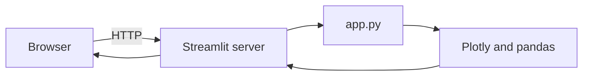

# Architecture

This document describes how the Crypto Market Analyzer is structured today and how it is expected to evolve. For setup and run instructions, see [README.md](../README.md).

## Overview

The current application is a single-file Streamlit client in [`app.py`](../app.py). The UI renders in the browser while Streamlit runs a Python process that rebuilds the page on interaction. There is no separate backend service, database, or job runner in the repository yet.

The product direction in [README.md](../README.md) calls for Python data pipelines, alerts, and newsletter automation. Those capabilities are represented in [`requirements.txt`](../requirements.txt) as forward-looking dependencies but are not wired into `app.py` today.

## Runtime flow

On each run, `app.py` applies page configuration and custom CSS, draws sidebar controls, and renders dashboard panels. Charts are built with Plotly and passed to `st.plotly_chart`. Tables use pandas `DataFrame` objects and `st.dataframe`. User input for the newsletter block is handled inline with Streamlit widgets and conditional success or error messages.

## UI composition

### Sidebar

The sidebar shows branding, a navigation radio group, a time-window select box, and a watchlist multiselect. The navigation labels (Dashboard, Alerts, News, Risk, Newsletter) are presentational only: selecting a different item does not route to a separate page or change the main layout.

### Main dashboard

The main area is a single dashboard view:

- Header with greeting and a UTC timestamp from `datetime.utcnow()`
- Four KPI cards (market cap, volume, risk index, active alerts) rendered as HTML snippets
- Left column: price trend chart (synthetic BTC series plus rolling mean) and trending report table
- Right column: horizontal risk bar chart, static alerts list, and static news snapshot
- Footer panel: newsletter email, frequency, format, and subscribe button with basic email validation

Styling uses injected CSS for cards and panels; layout uses Streamlit columns.

## Data today vs planned

| Area | Today | Planned |
|------|-------|---------|
| Market KPIs | Hard-coded HTML values in `app.py` | Ingestion from market APIs or aggregated feeds |
| Price trend | Locally generated sine-based series over 30 days | Live or cached OHLCV per watchlist asset |
| Trending report | Static pandas `DataFrame` | Computed rankings and sentiment from pipeline output |
| Risk graph | Fixed bar scores | Derived risk model inputs and history |
| Alerts and news | Static HTML copy | Rules engine plus news aggregation |
| Newsletter | Client-side validation and success message only | Persistence, scheduling, and outbound delivery |
| Sidebar filters | Widget state only; no effect on data | Drive queries and chart windows |

No environment variables or `.env` files are required to run the current UI. [`python-dotenv`](../requirements.txt) is listed for future configuration of API keys and service endpoints.

## Dependencies

| Package | Role today | Role planned |
|---------|------------|--------------|
| `streamlit` | UI shell, widgets, layout | Same |
| `pandas` | Trending table and rolling mean on mock prices | Pipeline transforms and report tables |
| `plotly` | Price trend and risk charts | Same |
| `requests` | Not used in `app.py` | HTTP market and news sources |
| `feedparser` | Not used in `app.py` | RSS and feed ingestion |
| `schedule` | Not used in `app.py` | Periodic jobs (reports, newsletter) |
| `pydantic` | Not used in `app.py` | Validated config and API models |
| `python-dotenv` | Not used in `app.py` | Local and deployment secrets |

CI and local setup install the full [`requirements.txt`](../requirements.txt) even though the entrypoint only imports a subset.

## Repository boundaries

| Path | Role |
|------|------|
| [`app.py`](../app.py) | Production UI entrypoint |
| [`requirements.txt`](../requirements.txt) | Python dependencies |
| [`docs/`](../docs/) | Architecture and automation playbooks |
| [`notebooks/`](../notebooks/) | Legacy Jupyter examples; not required to run the app |
| [`archive/legacy/`](../archive/legacy/) | Archived demo assets |

## Automation

- **CI** ([`.github/workflows/ci.yml`](../.github/workflows/ci.yml)): on push and pull request to `main`, `master`, and `feat/**`, installs dependencies on Python 3.11 and compiles `app.py` with `py_compile`. It does not start Streamlit or run browser tests.
- **Dev Container** ([`.devcontainer/devcontainer.json`](../.devcontainer/devcontainer.json)): installs dependencies via `updateContentCommand` on create and update. Streamlit is not started automatically; run `streamlit run app.py` from the repository root after the container is ready.

## Evolution

Near-term architecture aligned with [README.md](../README.md) product scope:

- Extract data access and transforms from `app.py` into importable modules as pipelines mature
- Back sidebar time window and watchlist with real query parameters
- Implement multi-page or routed views when Alerts, News, Risk, and Newsletter become distinct experiences
- Add scheduled workers for newsletter generation and alert evaluation, using packages already listed in `requirements.txt`
- Keep legacy notebooks and archives out of the production run path; active code stays at the repo root and under `docs/`
