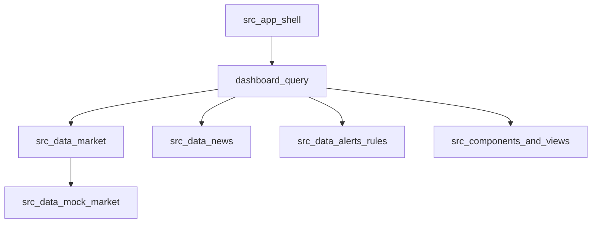

# M4 data pipelines

This document describes the M4 execution data path in the repository: sidebar filters, dashboard snapshots, market and feed ingestion, alert rules, and newsletter persistence. Source discovery research lives in [source-inventory-m4.md](source-inventory-m4.md).

## Snapshot assembly

`src/data/dashboard_query.py` exposes `load_dashboard_snapshot(time_window, watchlist)` and returns a `DashboardSnapshot` used by dashboard components, routed pages, and the assistant.

### Filter inputs

- `time_window`: `24H`, `7D`, `30D`, or `90D`
- `watchlist`: one or more of `BTC`, `ETH`, `SOL`, `BNB`, `XRP`

The primary watchlist asset drives the price trend chart. Trending rows, KPI copy, risk scores, news filtering, and alert evaluation all respect the selected filters.

## Market ingestion

Code lives under `src/data/market/`.

| Module | Role |
|---|---|
| `config.py` | Loads provider settings from env or `.env` |
| `binance.py` | Public klines fetch for supported symbols |
| `coingecko.py` | Market chart fallback fetch |
| `service.py` | Provider selection and mock fallback |

Default strategy matches [source-inventory-m4.md](source-inventory-m4.md): Binance first, CoinGecko second, mock last. The dashboard shows the active source in the price trend caption.

## News ingestion

Code lives under `src/data/news/`.

- `models.py` defines normalized `FeedItem` records (`id`, `source`, `published_at`, `title`, `url`, `tags`)
- `ingestion.py` parses RSS/Atom feeds with `feedparser`, dedupes by title and URL, filters by watchlist keywords when possible, and falls back to mock items on errors

The News page lists ingested items. The dashboard news snapshot shows the first few titles from the same query output.

## Alerts rules (MVP)

`src/data/alerts/rules.py` evaluates threshold rules over the selected price series.

- `drawdown`: fires when the primary asset change is below the negative threshold
- `momentum`: fires when the primary asset change is above the positive threshold

Each rule carries confidence metadata for future investor and developer signal work. The Alerts page documents configured rules and shows evaluated output. The dashboard alerts panel reuses the same snapshot list.

## Newsletter persistence

Code lives under `src/data/newsletter/`.

- `store.py` persists subscriptions to JSON under the configured data directory
- `delivery.py` routes to a stub provider by default or reports missing provider credentials

The Newsletter routed page owns subscribe UX. Email validation remains in `src/validation/email.py`.

## Routed pages

| Page | Entry | Data inputs |
|---|---|---|
| Dashboard | `pages/dashboard.py` | Full `DashboardSnapshot` plus assistant filters |
| Alerts | `pages/alerts.py` | Snapshot alerts and rule registry |
| News | `pages/news.py` | Normalized feed items |
| Risk | `pages/risk.py` | Window-adjusted risk scores |
| Newsletter | `pages/newsletter.py` | Local subscription store |

Navigation is configured in `app.py` with `st.navigation`. Sidebar filters are rendered from `src/app_shell.py` on pages that need watchlist and time-window context.

## Issue mapping

| Issue | Repository surface |
|---|---|
| [#12](https://github.com/fworks-tech/Jupyter-Crypto-Wizard/issues/12) | `app.py`, `pages/`, `src/views/` |
| [#14](https://github.com/fworks-tech/Jupyter-Crypto-Wizard/issues/14) | `src/app_shell.py`, `src/data/dashboard_query.py`, filter-aware components |
| [#15](https://github.com/fworks-tech/Jupyter-Crypto-Wizard/issues/15) | `src/data/market/` |
| [#16](https://github.com/fworks-tech/Jupyter-Crypto-Wizard/issues/16) | `src/data/news/` |
| [#17](https://github.com/fworks-tech/Jupyter-Crypto-Wizard/issues/17) | `src/data/alerts/rules.py`, Alerts page |
| [#18](https://github.com/fworks-tech/Jupyter-Crypto-Wizard/issues/18) | `src/data/newsletter/`, Newsletter page |
| [#13](https://github.com/fworks-tech/Jupyter-Crypto-Wizard/issues/13) | `.github/workflows/ci.yml`, `tests/test_app_smoke.py` |

## Related docs

- [Architecture.md](Architecture.md)
- [configuration.md](configuration.md)
- [validation-and-manual-qa.md](validation-and-manual-qa.md)
